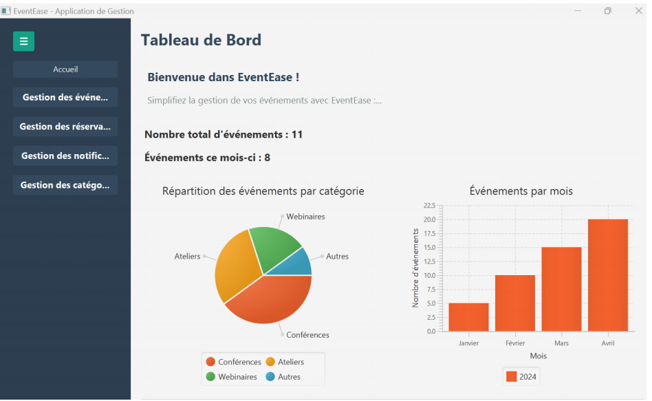
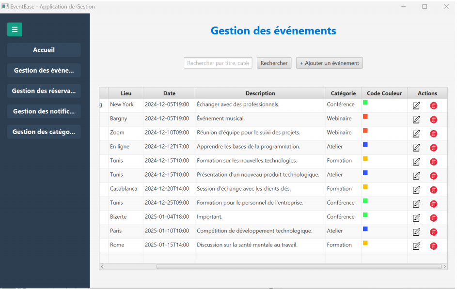
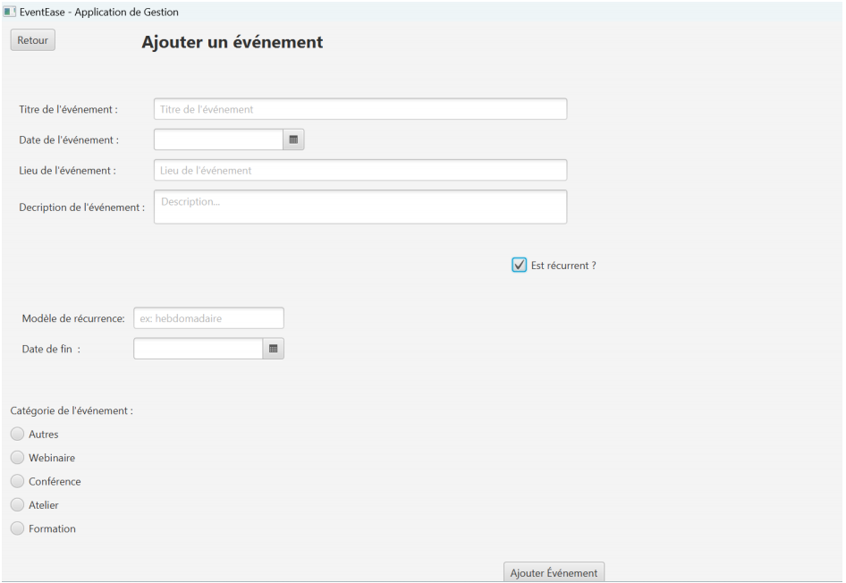
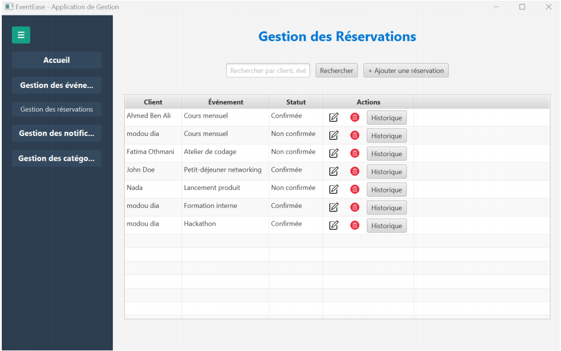

# 🎟️ Event Manager — Desktop App JavaFX  
Application Java pour la gestion complète d’événements, réservations et clients.

## 🚀 Présentation

Event Manager est une application desktop développée en **Java**, utilisant **JavaFX** et une architecture en couches (Modèle / DAO / Contrôleur / Vue).  
L’objectif : fournir un outil simple, ergonomique et efficace pour gérer des événements, les réservations associées et le suivi client.

Ce projet a été réalisé dans le cadre du module *Développement Java* — ENICarthage (2024/2025).

---

## ✨ Fonctionnalités principales

### 🎯 Gestion des Événements
- Création, modification et suppression d’événements  
- Recherche par titre, catégorie ou date  
- Code couleur par catégorie  
- Gestion des événements récurrents  

### 🧾 Réservations
- Réservations confirmées ou en attente  
- Association client ↔ événement  
- Historique complet des réservations d’un client  
- Fenêtre dédiée à l’historique  
- Actions rapides (modifier, supprimer…)

### 👥 Clients
- Ajout et modification d’un client  
- Consultation de son historique de réservations

---

## 🏛️ Architecture du projet

Le projet suit une structure claire en plusieurs couches :

```txt
src/
 ├── Modele/
 │    ├── Event/
 │    ├── Reservations/
 │    └── Client/
 ├── Controller/
 ├── DAO/
 └── Vue/     <-- JavaFX UI (Gestion événements, réservations, menu…)

## 🖥️ Aperçus de l’application

### 🔹 Page d’accueil


### 🔹 Gestion des événements


### 🔹 Fenêtre d’ajout d’événement


### 🔹 Gestion des réservations


